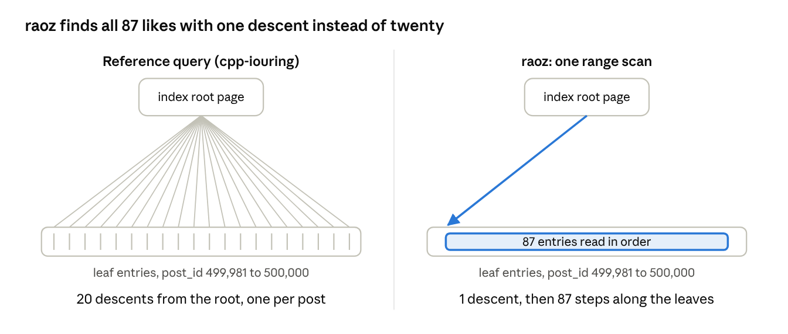

# How raoz's feed query works

Oct 8, 2026 · @mk

## Overview

raoz builds `/feed` from three range scans instead of one query with 20 correlated subqueries, cutting SQLite user time from about 43–53 µs to about 16 µs per feed request.

`GET /feed` must return the 20 newest posts (`ORDER BY created_at DESC, id DESC`), each with its author's username and its current like count. The reference query in the spec counts likes with a subquery that runs once per post. raoz relies on one fact about this data: the 20 newest posts almost always have adjacent ids. Their likes are therefore stored next to each other in the `likes_post_id_idx` index, and their rows next to each other in the `posts` table. One scan over each id range replaces 20 separate lookups.

The code is `h_feed` in [submissions/c-iouring-raoz/src/server.c](https://github.com/arjaythedev/twelve-dollar-server-challenge/pull/26/changes/35cc55c85fa837cd703367a740e0b8eeb6b825b4), lines 535–596, from [PR #26](https://github.com/arjaythedev/twelve-dollar-server-challenge/pull/26) by raoz.

## The tables and indexes involved

SQLite stores every table and every index as its own sorted B-tree, and the feed touches four of them. The schema is fixed by the challenge ([schema.sql](https://github.com/arjaythedev/twelve-dollar-server-challenge/blob/main/schema.sql)), so raoz uses exactly the same structures as every other submission.

| B-tree | Sorted by | Each entry holds | Entries in the seed |
| --- | --- | --- | --- |
| `posts` table | `id` (the rowid) | id, user\_id, body, created\_at | 500,000 |
| `posts_created_at_id_idx` | created\_at DESC, id DESC | created\_at, id | 500,000 |
| `likes_post_id_idx` | post\_id | post\_id, the like's rowid | 2,016,005 |
| `users` table | `id` (the rowid) | id, username, created\_at | 50,000 |

Two operations matter for cost:

- **A descent** starts at the root page of a B-tree and binary-searches down to a leaf. On the 2-million-entry likes index that is about 4 pages.
- **A step** moves to the next entry, usually on the same page. It costs almost nothing.

In the seed, the 20 newest posts are ids 499,981 to 500,000, created in time order, and together they have 87 likes. Because those ids are adjacent, their 87 entries sit side by side in `likes_post_id_idx`, and their 20 rows sit side by side in `posts`.

## How h\_feed works, step by step

The handler runs three prepared statements, then assembles the JSON in feed order. Each step below shows the SQL, SQLite's real query plan on the seed database, and the C code that uses the result.

### Step 1: the 20 newest ids

```sql
SELECT id FROM posts ORDER BY created_at DESC, id DESC LIMIT 20
```

```text
SCAN posts USING COVERING INDEX posts_created_at_id_idx
```

SQLite descends once to the start of the created\_at index and steps through 20 entries. The index is already in feed order and holds the id, so it is a covering index: the `posts` table is never read. The result is `[500000, 499999, …, 499981]`.

```c
while (n < 20 && (rc = sqlite3_step(st_feed_ids)) == SQLITE_ROW)
    ids[n++] = sqlite3_column_int64(st_feed_ids, 0);
// mn = 499981, mx = 500000
if (mx - mn >= FEED_SPAN) { h_feed_ref(fd); return; }   // FEED_SPAN = 256: ids too spread out
memset(slot, -1, mx - mn + 1);
for (int k = 0; k < n; k++) slot[ids[k] - mn] = k;     // id -> position in the feed
```

`slot[]` is a small lookup table from post id to feed position. `slot[19]` (id 500,000) is position 0, the newest, and `slot[0]` (id 499,981) is position 19. An id in the range that is not in the feed stays at -1.

### Step 2: all like counts in one scan

```sql
SELECT post_id FROM likes WHERE post_id BETWEEN ?1 AND ?2   -- 499981, 500000
```

```text
SEARCH likes USING COVERING INDEX likes_post_id_idx (post_id>? AND post_id<?)
```

SQLite descends once into the likes index to post\_id 499,981, then steps through the 87 entries that follow and stops after 500,000. SQL does not count anything here; each returned row adds 1 to an array:

```c
while ((rc = sqlite3_step(st_like_range)) == SQLITE_ROW) {
    int k = slot[sqlite3_column_int64(st_like_range, 0) - mn];
    if (k >= 0) likes[k]++;
}
```

### Step 3: all 20 rows in one scan

```sql
SELECT p.id, p.body, p.created_at, u.username
FROM posts p JOIN users u ON u.id = p.user_id
WHERE p.id BETWEEN ?1 AND ?2
```

```text
SEARCH p USING INTEGER PRIMARY KEY (rowid>? AND rowid<?)
SEARCH u USING INTEGER PRIMARY KEY (rowid=?)
```

SQLite descends once into the `posts` table and steps through 20 rows, which share one or two pages. Each row still needs one lookup in `users`, because authors are spread randomly over 50,000 users.

Rows arrive in ascending id order, which is oldest first. Each post's JSON is written to a scratch buffer, and `seg[]` and `seglen[]` record where it landed, indexed by feed position:

```c
while ((rc = sqlite3_step(st_feed_rows)) == SQLITE_ROW) {
    int k = slot[sqlite3_column_int64(st_feed_rows, 0) - mn];
    if (k < 0) continue;                     // in the range but not in the feed
    seg[k] = body.len;
    put_post(&body, st_feed_rows, likes[k]); // like count from step 2
    seglen[k] = body.len - seg[k];
    found++;
}
if (found != n) { h_feed_ref(fd); return; }  // safety net
```

### Step 4: assemble the response in feed order

```c
char *o = respond_head(fd, 200, 10 + body.len + (n - 1) + 2, 0); // headers into the output buffer
memcpy(o, "{\"posts\":[", 10); o += 10;
for (int k = 0; k < n; k++) {
    if (k) *o++ = ',';
    memcpy(o, body.p + seg[k], seglen[k]);   // position 0 = newest first
    o += seglen[k];
}
memcpy(o, "]}", 2);
```

The 20 JSON pieces are copied in positions 0 to 19 straight into the connection's output buffer, after the HTTP headers. The body length is known before the copy, so `Content-Length` is written first and the body is never copied again.

## Compared with the reference query

The reference query does about 61 B-tree descents per feed; raoz does about 23. Your `cpp-iouring-khalefa-ow` uses the reference query from the spec in one statement ([api.hpp:592–594, 629](https://github.com/khalefa-ow/twelve-dollar-server-challenge/blob/compare-all/submissions/cpp-iouring-khalefa-ow/src/api.hpp)):

```sql
SELECT p.id, p.body, p.created_at, u.username,
       (SELECT count(*) FROM likes l WHERE l.post_id = p.id)
FROM posts p JOIN users u ON u.id = p.user_id
ORDER BY p.created_at DESC, p.id DESC LIMIT 20
```

```text
SCAN p USING INDEX posts_created_at_id_idx
SEARCH u USING INTEGER PRIMARY KEY (rowid=?)
CORRELATED SCALAR SUBQUERY 1
   SEARCH l USING COVERING INDEX likes_post_id_idx (post_id=?)
```

For each of the 20 rows, SQLite steps through the created\_at index, then descends into `posts` for body and user\_id (the index does not hold them), then into `users`, then runs the subquery: a fresh descent into the likes index from its root, with its own setup inside SQLite's virtual machine.

| Work per feed request | Reference query (cpp-iouring) | raoz |
| --- | --- | --- |
| `posts_created_at_id_idx` | 1 descent + 20 steps | 1 descent + 20 steps |
| `posts` table | 20 descents | 1 descent + 20 steps |
| `likes_post_id_idx` | 20 descents + 20 subquery runs | 1 descent + 87 steps |
| `users` table | 20 descents | 20 descents |
| Total descents | about 61 | about 23 |
| Feed user CPU, measured | 43–53 µs | about 16 µs |



The same pattern applies to the `posts` table: 20 descents in the reference query against one descent and 20 steps in raoz's step 3.

CPU figures are server user time per `/feed` request from the 2026-10-08 comparison on a WSL2 laptop (`comparison/khalefa-ow-2026-10-08.md`); kernel time comes on top and is mostly network handling.

## Why it is correct and allowed

The result is identical to the reference query, and every request still reads SQLite, so rule 5 holds.

- **No caching.** All three statements run on every request. Nothing from an earlier request is reused, unlike a cached `/feed` response, which rule 5 forbids ("no response caches, query-result caches").
- **Consistent data.** One thread owns the only database connection, so no write can land between the three statements. Writes from the current batch's open group transaction are visible to all three alike.
- **Ids too far apart.** If the 20 newest ids span 256 or more (`FEED_SPAN`), step 1 hands the request to `h_feed_ref`, which runs the reference query. This also keeps `slot[]` a fixed 256-byte array on the stack.
- **Ids in the range that are not in the feed.** If `created_at` order and id order ever disagree, an id inside \[min, max\] may not be among the newest 20. Its `slot` is -1, so its likes and its row are skipped.
- **A row missing in step 3.** `found != n` falls back to the reference query. The source comment says this cannot happen without a concurrent writer.
- **An empty table.** Step 1 returns no ids, and the handler answers `{"posts":[]}` at once.

## Porting it to cpp-iouring or cpp-epoll\_inmem

The change fits in `handle_feed` and `init_db` in `api.hpp`; the transport is untouched, so the same code works in both servers. A sketch in the style of the existing file (untested):

```cpp
// init_db(): three more prepared statements
g_st_feed_ids  = prepare("SELECT id FROM posts ORDER BY created_at DESC, id DESC LIMIT 20");
g_st_like_rng  = prepare("SELECT post_id FROM likes WHERE post_id BETWEEN ?1 AND ?2");
g_st_feed_rows = prepare("SELECT p.id, p.body, p.created_at, u.username FROM posts p "
                         "JOIN users u ON u.id = p.user_id WHERE p.id BETWEEN ?1 AND ?2");

constexpr int64_t kFeedSpan = 256;

int handle_feed(std::string& b) {
  int64_t ids[20], likes[20] = {};
  int n = 0, rc;
  while (n < 20 && (rc = sqlite3_step(g_st_feed_ids)) == SQLITE_ROW)
    ids[n++] = sqlite3_column_int64(g_st_feed_ids, 0);
  sqlite3_reset(g_st_feed_ids);
  if (n < 20 && rc != SQLITE_DONE) return error(b, 500, "internal server error");
  if (n == 0) { b.append("{\"posts\":[]}"); return 200; }
  auto [mn, mx] = std::minmax_element(ids, ids + n);
  int64_t lo = *mn, hi = *mx;
  if (hi - lo >= kFeedSpan) return handle_feed_reference(b);   // today's handle_feed, renamed

  int8_t slot[kFeedSpan];
  std::memset(slot, -1, hi - lo + 1);
  for (int k = 0; k < n; ++k) slot[ids[k] - lo] = k;

  sqlite3_bind_int64(g_st_like_rng, 1, lo);
  sqlite3_bind_int64(g_st_like_rng, 2, hi);
  while ((rc = sqlite3_step(g_st_like_rng)) == SQLITE_ROW)
    if (int k = slot[sqlite3_column_int64(g_st_like_rng, 0) - lo]; k >= 0) ++likes[k];
  sqlite3_reset(g_st_like_rng);
  if (rc != SQLITE_DONE) return error(b, 500, "internal server error");

  std::string part[20];                       // or one scratch buffer + offsets, as raoz does
  int found = 0;
  sqlite3_bind_int64(g_st_feed_rows, 1, lo);
  sqlite3_bind_int64(g_st_feed_rows, 2, hi);
  while ((rc = sqlite3_step(g_st_feed_rows)) == SQLITE_ROW) {
    int k = slot[sqlite3_column_int64(g_st_feed_rows, 0) - lo];
    if (k < 0) continue;
    append_post_with_likes(part[k], g_st_feed_rows, likes[k]);  // append_post, like count passed in
    ++found;
  }
  sqlite3_reset(g_st_feed_rows);
  if (rc != SQLITE_DONE) return error(b, 500, "internal server error");
  if (found != n) return handle_feed_reference(b);

  b.append("{\"posts\":[");
  for (int k = 0; k < n; ++k) { if (k) b.push_back(','); b.append(part[k]); }
  b.append("]}");
  return 200;
}
```

- `append_post_with_likes` is today's `append_post` with the like count passed in, instead of read from column 4.
- `std::string part[20]` allocates; a reused scratch buffer with offsets, as in raoz's `seg[]`, avoids that.
- `test/test.sh` checks the feed against the expected output, so run it after the change, then `comparison/cpu-cost.sh` for the feed cost.
